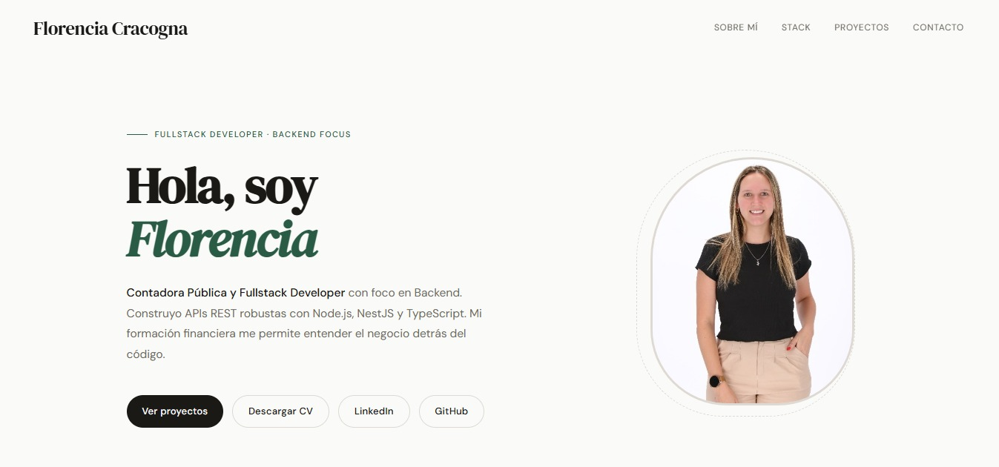

# Florencia Cracogna · Portfolio

Portfolio personal de **Florencia Cracogna**, desarrolladora fullstack con foco en backend y Contadora Pública con más de 5 años de experiencia en impuestos, análisis financiero y sistemas ERP.

🔗 **Sitio:** [florenciacracogna.vercel.app](https://florenciacracogna.vercel.app)



---

## 👩‍💻 Sobre mí

Vengo del mundo contable: liquidación de impuestos multijurisdiccionales, conciliaciones y migraciones de ERP (AX2012 → Dynamics 365 y AX2012 → SAP). Me formé como desarrolladora fullstack en Henry y hoy combino los dos perfiles: entiendo cómo funcionan los procesos de negocio y sé construir el software que los soporta.

Me interesan especialmente los proyectos de fintech, sistemas de gestión y herramientas que automatizan procesos administrativos.

**Stack principal:** Node.js · TypeScript · NestJS · PostgreSQL · React · Next.js

## 🗂️ Qué hay en el sitio

- **Presentación** con foto y descarga del CV en PDF.
- **Stack tecnológico** con los logos de cada herramienta.
- **Proyectos** con descripción, tecnologías y links a los repos y demos.
- **Contacto**: email, LinkedIn y GitHub.

## 🛠️ Cómo está hecho

| Área | Tecnología |
|---|---|
| Framework | React 19 |
| Build | Vite 8 |
| Estilos | CSS propio (sin frameworks), con variables para la paleta |
| Íconos | react-icons |
| Tipografías | DM Serif Display + DM Sans |
| Deploy | Vercel |

Algunos detalles de implementación: navbar sticky con menú hamburguesa en mobile, botón para volver arriba que aparece al hacer scroll y diseño responsive.

## 📁 Estructura

```
public/
├── Imagen CV.jpeg              # Foto de perfil
└── Florencia_Cracogna_CV.pdf   # CV descargable
src/
├── components/
│   ├── Contact.jsx             # Links de contacto
│   ├── Navbar.jsx              # Navegación sticky + menú mobile
│   ├── ScrollToTop.jsx         # Botón para volver arriba
│   └── Stack.jsx               # Grilla de tecnologías con logos
├── App.jsx                     # Secciones del sitio
├── App.css                     # Estilos de los componentes
├── index.css                   # Estilos globales
└── main.jsx                    # Punto de entrada
```

## 🚀 Correr el proyecto localmente

Requisitos: Node.js 20.19 o superior.

```bash
git clone https://github.com/FlorenciaCracogna/portfolio-florencia.git
cd portfolio-florencia
npm install
npm run dev
```

El sitio queda disponible en `http://localhost:5173`.

### Scripts

| Comando | Qué hace |
|---|---|
| `npm run dev` | Servidor de desarrollo |
| `npm run build` | Build de producción en `dist/` |
| `npm run preview` | Sirve el build localmente |
| `npm run lint` | ESLint |

## 📬 Contacto

- 📧 [cra.florenciacracogna@gmail.com](mailto:cra.florenciacracogna@gmail.com)
- 💼 [linkedin.com/in/florencia-cracogna](https://linkedin.com/in/florencia-cracogna)
- 🐙 [github.com/FlorenciaCracogna](https://github.com/FlorenciaCracogna)
